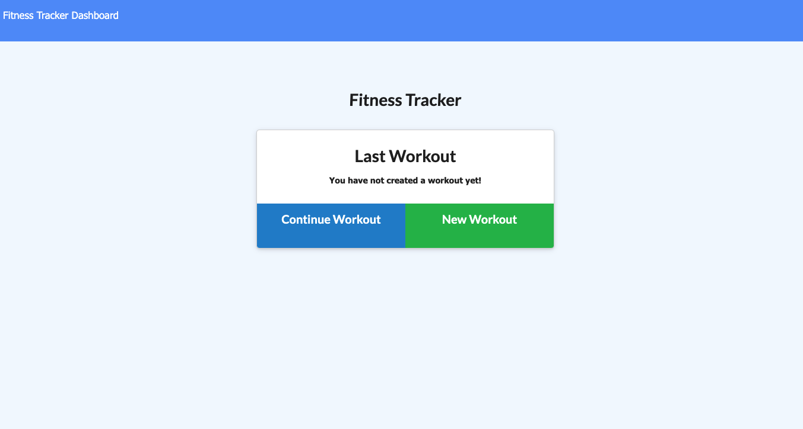

# Fitness_Tracker

# Description 
In this application, we created a workout tracker. For this assignment we used Mongo Database with a Mongoose schema and handle routes created with express.

# Final Image 

# Deployed Link 

# Questions 

